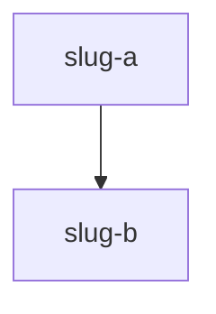

# AGENTS.md - Personal Knowledge Base Schema

> Adapted from [Andrej Karpathy's LLM Knowledge Base](https://gist.github.com/karpathy/442a6bf555914893e9891c11519de94f) architecture.
> Instead of ingesting external articles, this system compiles knowledge from your own AI conversations.

## The Compiler Analogy

```
daily/          = source code    (your conversations - the raw material)
LLM             = compiler       (extracts and organizes knowledge)
knowledge/      = executable     (structured, queryable knowledge base)
lint            = test suite     (health checks for consistency)
queries         = runtime        (using the knowledge)
```

You don't manually organize your knowledge. You have conversations, and the LLM handles the synthesis, cross-referencing, and maintenance.

---

## Architecture

### Layer 1: `daily/` - Conversation Logs (Immutable Source)

Daily logs capture what happened in your AI coding sessions. These are the "raw sources" - append-only, never edited after the fact.

```
daily/
├── 2026-04-01.md
├── 2026-04-02.md
├── ...
```

Each file follows this format:

```markdown
# Daily Log: YYYY-MM-DD

## Sessions

### Session (HH:MM) - Brief Title

**Context:** What the user was working on.

**Key Exchanges:**
- User asked about X, assistant explained Y
- Decided to use Z approach because...
- Discovered that W doesn't work when...

**Decisions Made:**
- Chose library X over Y because...
- Architecture: went with pattern Z

**Lessons Learned:**
- Always do X before Y to avoid...
- The gotcha with Z is that...

**Action Items:**
- [ ] Follow up on X
- [ ] Refactor Y when time permits
```

### Layer 2: `knowledge/` - Compiled Knowledge (LLM-Owned)

The LLM owns this directory entirely. Humans read it but rarely edit it directly.

```
knowledge/
├── index.md              # Master catalog - every article with one-line summary
├── log.md                # Append-only chronological build log
├── concepts/             # Atomic knowledge articles
├── connections/          # Cross-cutting insights linking 2+ concepts
└── qa/                   # Filed query answers (compounding knowledge)
```

### Layer 3: This File (AGENTS.md)

The schema that tells the LLM how to compile and maintain the knowledge base. This is the "compiler specification."

---

## Structural Files

### `knowledge/index.md` - Master Catalog

The primary retrieval mechanism — the LLM reads this FIRST when answering any query, then
selects relevant articles to read in full. It is **generated**, not hand-edited: run
`scripts/build_index.py` (the compiler calls it automatically after every compile) to
rebuild it from article frontmatter. Each row's text comes from that article's `summary:`
field — so to change the catalog, edit the article's `summary:`, never the index directly.

The catalog is **sectioned by project → subsystem** so it mirrors the architecture: an `H2`
per `project:`, an `H3` per `subsystem:` within it, and one table per subsystem.

Format:

```markdown
# Knowledge Base Index

## acme-app

### auth

| Article | Type | Status | Summary | Updated |
|---------|------|--------|---------|---------|
| [[concepts/supabase-auth]] | concept | shipped | Row-level security patterns and JWT gotchas | 2026-04-02 |
| [[connections/auth-and-webhooks]] | connection | active | Token verification shared across Supabase auth and Stripe webhooks | 2026-04-04 |
```

A row's section is its article's `project:` / `subsystem:`; its Summary is the article's
`summary:`. Keep those frontmatter fields current and the index follows.

### `knowledge/log.md` - Build Log

Append-only chronological record of every compile, query, lint, and supersede operation.

It is also the **home for decision history**. Articles always state only the *current*
truth (no "we used to do X but now Y" clutter); whenever a compile reverses or replaces a
prior decision, the old→new change is recorded here as a `supersede` entry. A decision that
changes several times leaves several `supersede` entries — the full chronology lives in the
log while the article stays clean and current.

Format:

```markdown
# Build Log

## [2026-04-01T14:30:00] compile | Daily Log 2026-04-01
- Source: daily/2026-04-01.md
- Articles created: [[concepts/nextjs-project-structure]], [[concepts/tailwind-setup]]
- Articles updated: (none)
- Decisions superseded: (none)

## [2026-04-03T11:00:00] supersede | Daily Log 2026-04-03
- Article: [[concepts/auth-strategy]]
- Changed: session storage mechanism
- From: JWT in localStorage
- To: httpOnly cookie sessions
- Reason: XSS exposure of localStorage tokens raised in 2026-04-03 review

## [2026-04-02T09:00:00] query | "How do I handle auth redirects?"
- Consulted: [[concepts/supabase-auth]], [[concepts/nextjs-middleware]]
- Filed to: [[qa/auth-redirect-handling]]
```

---

## Article Formats

### Concept Articles (`knowledge/concepts/`)

One article per atomic piece of knowledge. These are facts, patterns, decisions, preferences, and lessons extracted from your conversations.

```markdown
---
title: "Concept Name"
project: project-slug
type: concept
status: active
subsystem: subsystem-slug
milestone: M5
summary: "One-line catalog summary — this is the text the generated index shows."
aliases: [alternate-name]
tags: [domain, topic]
sources:
  - "daily/2026-04-01.md"
  - "daily/2026-04-03.md"
created: 2026-04-01T00:00:00-06:00
updated: 2026-04-03T00:00:00-06:00
valid_as_of: 2026-04-03
code_baseline: { crm: <sha>, metadata: <sha>, dirty: <bool>, stamped: 2026-04-03 }
---

# Concept Name

[2-4 sentence core explanation]

## Key Points

- [Bullet points, each self-contained]

## Details

[Deeper explanation, encyclopedia-style paragraphs]

## Related Concepts

- [[concepts/related-concept]] - How it connects

## Sources

- [[daily/2026-04-01.md]] - Initial discovery during project setup
- [[daily/2026-04-03.md]] - Updated after debugging session
```

### Frontmatter fields (all article types)

These fields drive both index-guided retrieval and Obsidian Dataview/Bases queries
(e.g. `TABLE status, updated FROM "knowledge/concepts" WHERE subsystem = "credit-notes"
AND status != "superseded" SORT updated DESC`). Populate them on every article.

| Field | Required | Values / format |
|-------|----------|-----------------|
| `title` | yes | Human title (quoted). |
| `project` | yes | The app/platform slug (e.g. `stripe-ledger`). Reuse an existing related article's slug; new slug only for a genuinely different app. |
| `type` | yes | `concept` \| `connection` \| `moc` \| `reference` \| `qa`. Derives from the folder for the three core kinds; `moc`/`reference` are curated. |
| `status` | yes | `active` (current, in-flight) \| `shipped` (done, current) \| `superseded` (replaced — kept as a page only if the concept still exists) \| `needs-reverification` (cited code moved; see PR D Tier-2). The `needs-reverification` ↔ `active` transitions are **automated** by the re-check loop (`scripts/recheck.py`, run after every compile): flagged articles self-mark and gain a loop-owned `reverify_reasons:` key; when the cause clears (recompile with fresh baseline, reverted code, or a human attesting via `recheck.py --verified <slug>`) the loop restores `active`. A human-set `needs-reverification` (no `reverify_reasons`) is never auto-cleared. |
| `subsystem` | yes | The architecture area this belongs to — **this groups the index** and is the primary Dataview facet. Reuse an existing subsystem slug (see the sections in `index.md`); introduce a new one only for a genuinely new area. |
| `summary` | yes | The one-line catalog summary, **always double-quoted** (it routinely contains colons — unquoted `: ` is invalid YAML and breaks Obsidian). **Lives here, not in the index** — the index is regenerated from this field. Keep it current when the article changes. |
| `milestone` | optional | The milestone/phase the work belongs to (e.g. `M5`, `Phase-7`, `v1.5`). Omit if not applicable. |
| `unverifiable` | optional | PR D Tier-4: tag articles whose **load-bearing claims cannot be verified against our code** — `business_rule` (tax law, filing rules, accounting policy: needs a cited statute/authority or the operator) and/or `external_api` (Stripe/Hospitable/BANXICO/OS behavior: needs vendor docs or empirical re-test). Comma-combine when both apply. The verification ladder must NEVER auto-trust these claims; code-grounding gates (Tier-1/2/3) only cover the article's incidental code citations. |
| `component` | optional | A finer-grained area within the subsystem (e.g. `orchestrator`, `audit.py`). |
| `aliases` | optional | 0–2 only. Never duplicate the filename; scope generic terms so they don't collide. |
| `tags` | optional | Free domain/topic tags. |
| `sources` | yes (concept/connection) | The daily log(s) that contributed. |
| `created` / `updated` | yes | Full ISO 8601 with offset (`2026-04-03T00:00:00-06:00`) so Dataview can sort. `updated` = the compile/edit date. |
| `valid_as_of` | yes | The knowledge *vintage* (the daily date the knowledge is from), date-only. NOT the compile date. Stamped by `stamp_baseline.py` / born-stamped by `compile.py`. |
| `code_baseline` | yes | `{ crm, metadata, dirty, stamped }` — repo SHAs that were HEAD at the vintage. Drives the Tier-2 staleness scan. |
| `connects` | connection only | The 2+ concepts the connection links. |
| `question` / `consulted` / `filed` | qa only | The question, the articles read, and the file date. |

### Connection Articles (`knowledge/connections/`)

Cross-cutting synthesis linking 2+ concepts. Created when a conversation reveals a non-obvious relationship.

```markdown
---
title: "Connection: X and Y"
project: project-slug
type: connection
status: active
subsystem: subsystem-slug
summary: "One-line catalog summary of the relationship."
connects:
  - "concepts/concept-x"
  - "concepts/concept-y"
sources:
  - "daily/2026-04-04.md"
created: 2026-04-04T00:00:00-06:00
updated: 2026-04-04T00:00:00-06:00
valid_as_of: 2026-04-04
code_baseline: { crm: <sha>, metadata: <sha>, dirty: <bool>, stamped: 2026-04-04 }
---

# Connection: X and Y

## The Connection

[What links these concepts]

## Key Insight

[The non-obvious relationship discovered]

## Evidence

[Specific examples from conversations]

## Related Concepts

- [[concepts/concept-x]]
- [[concepts/concept-y]]
```

### Q&A Articles (`knowledge/qa/`)

Filed answers from queries. Every complex question answered by the system can be permanently stored, making future queries smarter.

```markdown
---
title: "Q: Original Question"
project: project-slug
type: qa
status: active
subsystem: subsystem-slug
summary: "One-line summary of the answer."
question: "The exact question asked"
consulted:
  - "concepts/article-1"
  - "concepts/article-2"
created: 2026-04-05T00:00:00-06:00
updated: 2026-04-05T00:00:00-06:00
filed: 2026-04-05
---

# Q: Original Question

## Answer

[The synthesized answer with [[wikilinks]] to sources]

## Sources Consulted

- [[concepts/article-1]] - Relevant because...
- [[concepts/article-2]] - Provided context on...

## Follow-Up Questions

- What about edge case X?
- How does this change if Y?
```

### MOC Articles (`knowledge/mocs/`)

Map-of-Content hubs (`type: moc`) — the curated "architecture map" entry points, one per
project (and per large subsystem when warranted). **Links, not walls of text**: a MOC is a
navigable map of the existing articles, with one-line annotations and a clickable Mermaid
architecture diagram, never a re-statement of their content.

Conventions:
- Filenames stay kebab-case (`moc-<scope>.md`) — NOT Title-Case — so the deterministic
  slug links keep working. The `title:` carries the human form (`"MOC: Stripe Ledger"`).
- The Mermaid diagram uses article slugs as node ids and the Obsidian `internal-link`
  class so nodes are clickable: `class slug-a,slug-b internal-link;`
- MOCs are exempt from the orphan / backlink-reciprocity lint checks (hubs link out by
  design); they still require the full frontmatter (`type: moc`, `status`, `subsystem`,
  `summary`).
- **Compiler contract:** when a compile creates a new article, add a link for it (with a
  one-line annotation) to the relevant section of its project's MOC. Do not rewrite or
  restructure the MOC beyond that.

````markdown
---
title: "MOC: Project Name"
project: project-slug
type: moc
status: active
subsystem: architecture
summary: "Architecture map + curated entry points for the project."
created: 2026-04-05T00:00:00-06:00
updated: 2026-04-05T00:00:00-06:00
---

# MOC: Project Name

> [!summary] One-paragraph orientation: what the system is, the load-bearing idea.

## Architecture



## <Subsystem>

- [[concepts/slug-a]] — one-line annotation
- [[concepts/slug-b]] — one-line annotation
````

---

## Core Operations

### 1. Compile (daily/ -> knowledge/)

When processing a daily log:

1. Read the daily log file
2. Read `knowledge/index.md` to understand current knowledge state
3. Read existing articles that may need updating
4. For each piece of knowledge found in the log:
   - If an existing concept article covers this topic: UPDATE it with new information, add the daily log as a source
   - If it's a new topic: CREATE a new `concepts/` article
5. If the log reveals a non-obvious connection between 2+ existing concepts: CREATE a `connections/` article
6. APPEND to `knowledge/log.md`

The index is **not** hand-edited — it is regenerated from frontmatter by
`scripts/build_index.py` after the compile. So instead of writing index rows, make sure
every new/updated article carries a current `summary:`, the right `subsystem:`, and the
other frontmatter fields; the catalog follows automatically.

**Important guidelines:**
- A single daily log may touch 3-10 knowledge articles
- Prefer updating existing articles over creating near-duplicates
- Reuse an existing `subsystem:` slug where one fits; only add a new subsystem for a
  genuinely new area (it becomes a new index section)
- Use Obsidian-style `[[wikilinks]]` with full relative paths from knowledge/
- Write in encyclopedia style - factual, concise, self-contained
- Every article must carry the full frontmatter (see "Frontmatter fields")
- Every article must link back to its source daily logs

### 2. Query (Ask the Knowledge Base)

1. Read `knowledge/index.md` (the master catalog)
2. Based on the question, identify 3-10 relevant articles from the index
3. Read those articles in full
4. Synthesize an answer with `[[wikilink]]` citations
5. If `--file-back` is specified: create a `knowledge/qa/` article and update index.md and log.md

**Why this works without RAG:** At personal knowledge base scale (50-500 articles), the LLM reading a structured index outperforms cosine similarity. The LLM understands what the question is really asking and selects pages accordingly. Embeddings find similar words; the LLM finds relevant concepts.

### 3. Lint (Health Checks)

Seven checks, run periodically:

1. **Broken links** - `[[wikilinks]]` pointing to non-existent articles
2. **Orphan pages** - Articles with zero inbound links from other articles
3. **Orphan sources** - Daily logs that haven't been compiled yet
4. **Stale articles** - Source daily log changed since article was last compiled
5. **Contradictions** - Conflicting claims across articles (requires LLM judgment)
6. **Missing backlinks** - A links to B but B doesn't link back to A
7. **Sparse articles** - Below 200 words, likely incomplete

Output: a markdown report with severity levels (error, warning, suggestion).

---

## Conventions

- **Wikilinks:** Use Obsidian-style `[[path/to/article]]` without `.md` extension
- **Writing style:** Encyclopedia-style, factual, third-person where appropriate
- **Dates:** ISO 8601. `created`/`updated` carry a full timestamp with offset
  (`2026-04-03T00:00:00-06:00`) so Dataview can sort by them; `valid_as_of`/`filed` are
  date-only; `log.md` timestamps are full ISO.
- **Callouts:** Use Obsidian callouts for scannability — `> [!summary]` for the core
  takeaway, `> [!warning]` for gotchas/footguns, `> [!note]` for asides. Prefer these over
  plain bold labels for Key Points and caveats.
- **Aliases:** 0–2 per article, never the filename itself, and scope generic terms so they
  don't collide across articles.
- **File naming:** lowercase, hyphens for spaces (e.g., `supabase-row-level-security.md`)
- **Frontmatter YAML safety:** any scalar value containing `: ` MUST be double-quoted — `summary:` always. Unquoted colons parse in grep-based tools but are invalid YAML.
- **Frontmatter:** Every article must carry the fields in the "Frontmatter fields" table
  above — at minimum `title`, `project`, `type`, `status`, `subsystem`, `summary`,
  `sources`, `created`, `updated`.
- **Sources:** Always link back to the daily log(s) that contributed to an article
- **Backticks = literal code only:** Put inside `` `backticks` `` ONLY identifiers that exist
  verbatim in the code — function/method/variable/field/file names, metadata keys, config
  values, API fields. Do **not** backtick formula variables, math placeholders, or prose
  shorthand (write *the gross-receipt accumulator* in prose, not `` `grossReceiptAcc` ``; a
  template like `{cc}_tax_{prefix}_due` is fine only if that literal key appears in the code).
  Backticked tokens are treated as verifiable code symbols by the Tier-1 gate
  (`scripts/verify.py`); backticking a non-symbol manufactures a false "absent" finding — this
  is the dominant Tier-1 false positive. When citing a *rejected* or *superseded* value, keep
  the rejection explicit in the same sentence ("chosen over", "rather than", "no longer", "did
  not …") so the gate reads it as a correct-negative rather than a missing symbol.

---

## Full Project Structure

```
llm-personal-kb/
|-- .claude/
|   |-- settings.json                # Hook configuration (auto-activates in Claude Code)
|-- .gitignore                       # Excludes runtime state, temp files, caches
|-- AGENTS.md                        # This file - schema + full technical reference
|-- README.md                        # Concise overview + quick start
|-- pyproject.toml                   # Dependencies (at root so hooks can find it)
|-- daily/                           # "Source code" - conversation logs (immutable)
|-- knowledge/                       # "Executable" - compiled knowledge (LLM-owned)
|   |-- index.md                     #   Master catalog - THE retrieval mechanism
|   |-- log.md                       #   Append-only build log
|   |-- concepts/                    #   Atomic knowledge articles
|   |-- connections/                 #   Cross-cutting insights linking 2+ concepts
|   |-- qa/                          #   Filed query answers (compounding knowledge)
|-- scripts/                         # CLI tools
|   |-- compile.py                   #   Compile daily logs -> knowledge articles
|   |-- query.py                     #   Ask questions (index-guided, no RAG)
|   |-- lint.py                      #   7 health checks
|   |-- flush.py                     #   Extract memories from conversations (background)
|   |-- config.py                    #   Path constants
|   |-- utils.py                     #   Shared helpers
|-- hooks/                           # Claude Code hooks
|   |-- session-start.py             #   Injects knowledge into every session
|   |-- session-end.py               #   Extracts conversation -> daily log
|   |-- pre-compact.py               #   Safety net: captures context before compaction
|-- reports/                         # Lint reports (gitignored)
```

---

## Hook System (Automatic Capture)

Hooks are configured in `.claude/settings.json` and fire automatically when you use Claude Code in this project.

### `.claude/settings.json` Format

```json
{
  "hooks": {
    "SessionStart": [{ "matcher": "", "hooks": [{ "type": "command", "command": "uv run python hooks/session-start.py", "timeout": 15 }] }],
    "PreCompact": [{ "matcher": "", "hooks": [{ "type": "command", "command": "uv run python hooks/pre-compact.py", "timeout": 10 }] }],
    "SessionEnd": [{ "matcher": "", "hooks": [{ "type": "command", "command": "uv run python hooks/session-end.py", "timeout": 10 }] }]
  }
}
```

Commands use simple relative paths from the project root. Empty `matcher` catches all events.

### Hook Details

**`session-start.py`** (SessionStart)
- Pure local I/O, no API calls, runs in under 1 second
- Reads `knowledge/index.md` and the most recent daily log
- Outputs JSON to stdout: `{"hookSpecificOutput": {"hookEventName": "SessionStart", "additionalContext": "..."}}`
- Claude sees the knowledge base index at the start of every session
- Max context: 20,000 characters

**`session-end.py`** (SessionEnd)
- Reads hook input from stdin (JSON with `session_id`, `transcript_path`, `cwd`)
- Copies the raw JSONL transcript to a temp file (no parsing in the hook - keeps it fast)
- Spawns `flush.py` as a fully detached background process
- Recursion guard: exits immediately if `CLAUDE_INVOKED_BY` env var is set

**`pre-compact.py`** (PreCompact)
- Same architecture as session-end.py
- Fires before Claude Code auto-compacts the context window
- Guards against empty `transcript_path` (known Claude Code bug #13668)
- Critical for long sessions: captures context before summarization discards it

**Why both PreCompact and SessionEnd?** Long-running sessions may trigger multiple auto-compactions before you close the session. Without PreCompact, intermediate context is lost to summarization before SessionEnd ever fires.

### Background Flush Process (`flush.py`)

Spawned by both hooks as a fully detached background process:
- **Windows:** `CREATE_NEW_PROCESS_GROUP | DETACHED_PROCESS` flags
- **Mac/Linux:** `start_new_session=True`

This ensures flush.py survives after Claude Code's hook process exits.

**What flush.py does:**
1. Sets `CLAUDE_INVOKED_BY=memory_flush` env var (prevents recursive hook firing)
2. Reads the pre-extracted conversation context from the temp `.md` file
3. Skips if context is empty or if same session was flushed within 60 seconds (deduplication)
4. Calls Claude Agent SDK (`query()` with `allowed_tools=[]`, `max_turns=2`)
5. Claude decides what's worth saving - returns structured bullet points or `FLUSH_OK`
6. Appends result to `daily/YYYY-MM-DD.md`
7. Cleans up temp context file
8. **End-of-day auto-compilation:** If it's past 6 PM local time (`COMPILE_AFTER_HOUR = 18`) and today's daily log has changed since its last compilation (hash comparison against `state.json`), spawns `compile.py` as another detached background process. This means compilation happens automatically once a day without needing a cron job or manual trigger.

### JSONL Transcript Format

Claude Code stores conversations as `.jsonl` files. Messages are nested under a `message` key:

```python
entry = json.loads(line)
msg = entry.get("message", {})
role = msg.get("role", "")     # "user" or "assistant"
content = msg.get("content", "")  # string or list of content blocks
```

Content can be a string or a list of blocks (`{"type": "text", "text": "..."}` dicts).

---

## Script Details

### compile.py - The Compiler

Uses the Claude Agent SDK's async streaming `query()`:

```python
async for message in query(
    prompt=compile_prompt,
    options=ClaudeAgentOptions(
        cwd=str(ROOT_DIR),
        system_prompt={"type": "preset", "preset": "claude_code"},
        allowed_tools=["Read", "Write", "Edit", "Glob", "Grep"],
        permission_mode="acceptEdits",
        max_turns=30,
    ),
):
```

- Builds a prompt with: AGENTS.md schema, current index, all existing articles, and the daily log
- Claude reads the daily log, decides what concepts to extract, and writes files directly
- `permission_mode="acceptEdits"` auto-approves all file operations
- Incremental: tracks SHA-256 hashes of daily logs in `state.json`, skips unchanged files
- Cost: ~$0.45-0.65 per daily log (increases as KB grows)

**CLI:**
```bash
uv run python scripts/compile.py              # compile new/changed only
uv run python scripts/compile.py --all        # force recompile everything
uv run python scripts/compile.py --file daily/2026-04-01.md
uv run python scripts/compile.py --dry-run
```

### query.py - Index-Guided Retrieval

Puts ONLY the index (`knowledge/index.md`) into the prompt, then has the Agent SDK
session pick the 3-10 relevant articles and read just those with the Read tool. No
RAG, and no loading the whole KB — the index is the retrieval mechanism.

At personal KB scale (50-500 articles), the LLM reading a structured index outperforms vector similarity. The LLM understands what you're really asking; cosine similarity just finds similar words.

Like compile.py it sets the `CLAUDE_INVOKED_BY` recursion guard (to `query`) before
the SDK import, runs with the same per-call timeout+retry from `capture-config`, and
emits to `activity.jsonl` (`source=query`) so the Obsidian plugin notifies on answers.
Read-only by default (Read/Glob/Grep); `--file-back` also grants Write/Edit.

**CLI:**
```bash
uv run python scripts/query.py "What auth patterns do I use?"
uv run python scripts/query.py "What CN types exist?" --project stripe-ledger
uv run python scripts/query.py "What's my error handling strategy?" --file-back
```

`--project <slug>` pre-filters the index to one project (the Project column) before the
LLM sees it. With `--file-back`, the agent files a Q&A article in `knowledge/qa/` (with
`project:` + `type: qa` frontmatter), adds an index row, and appends a `query` entry to
`knowledge/log.md`. This is the compounding loop - every question makes the KB smarter.
Thin surfaces: the `/ask` slash command, `scripts/query.sh`, and the devlore Obsidian
plugin's "Ask the devlore knowledge base" command + ribbon button.

### lint.py - Health Checks

Seven checks:

| Check | Type | Catches |
|-------|------|---------|
| Broken links | Structural | `[[wikilinks]]` to non-existent articles |
| Orphan pages | Structural | Articles with zero inbound links |
| Orphan sources | Structural | Daily logs not yet compiled |
| Stale articles | Structural | Source logs changed since compilation |
| Missing backlinks | Structural | A links to B but B doesn't link back |
| Sparse articles | Structural | Under 200 words |
| Contradictions | LLM | Conflicting claims across articles |

**CLI:**
```bash
uv run python scripts/lint.py                    # all checks
uv run python scripts/lint.py --structural-only  # skip LLM check (free)
```

Reports saved to `reports/lint-YYYY-MM-DD.md`.

---

## State Tracking

`scripts/state.json` tracks:
- `ingested` - map of daily log filenames to SHA-256 hashes, compilation timestamps, and costs
- `query_count` - total queries run
- `last_lint` - timestamp of most recent lint
- `total_cost` - cumulative API cost

`scripts/last-flush.json` tracks flush deduplication (session_id + timestamp).

Both are gitignored and regenerated automatically.

---

## Dependencies

`pyproject.toml` (at project root):
- `claude-agent-sdk>=0.1.29` - Claude Agent SDK for LLM calls with tool use
- `python-dotenv>=1.0.0` - Environment variable management
- `tzdata>=2024.1` - Timezone data
- Python 3.12+, managed by [uv](https://docs.astral.sh/uv/)

No API key needed - uses Claude Code's built-in credentials at `~/.claude/.credentials.json`.

---

## Costs

| Operation | Cost |
|-----------|------|
| Compile one daily log | $0.45-0.65 |
| Query (no file-back) | ~$0.15-0.25 |
| Query (with file-back) | ~$0.25-0.40 |
| Full lint (with contradictions) | ~$0.15-0.25 |
| Structural lint only | $0.00 |
| Memory flush (per session) | ~$0.02-0.05 |

---

## Customization

### Additional Article Types

Add directories like `people/`, `projects/`, `tools/` to `knowledge/`. Define the article format in this file (AGENTS.md) and update `utils.py`'s `list_wiki_articles()` to include them.

### Obsidian Integration

The knowledge base is pure markdown with `[[wikilinks]]` - works natively in Obsidian. Point a vault at `knowledge/` for graph view, backlinks, and search.

### Scaling Beyond Index-Guided Retrieval

At ~2,000+ articles / ~2M+ tokens, the index becomes too large for the context window. At that point, add hybrid RAG (keyword + semantic search) as a retrieval layer before the LLM. See Karpathy's recommendation of `qmd` by Tobi Lutke for search at scale.
